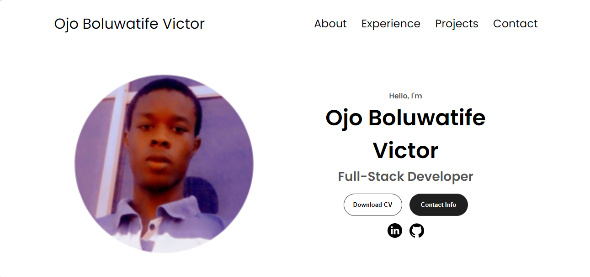

# Portfolio Website

This is a portfolio website showcasing my skills, projects, and contact information. It is built using HTML, CSS, and JavaScript.

## Features

- **About Me:** Provides an introduction to myself, my background, and my interests.
- **Experience:** Highlights my professional experience, skills, and qualifications.
- **Projects:** Showcases the projects I have worked on, including descriptions and links to GitHub repositories or live demos.
- **Contact:** Provides contact information for reaching out to me.

## Technologies Used

- **HTML:** Used for structuring the content of the website.
- **CSS:** Used for styling and layout design.
- **JavaScript:** Used for interactivity and dynamic content.

## Preview
